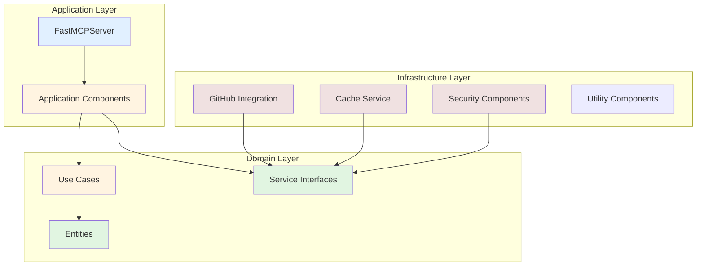
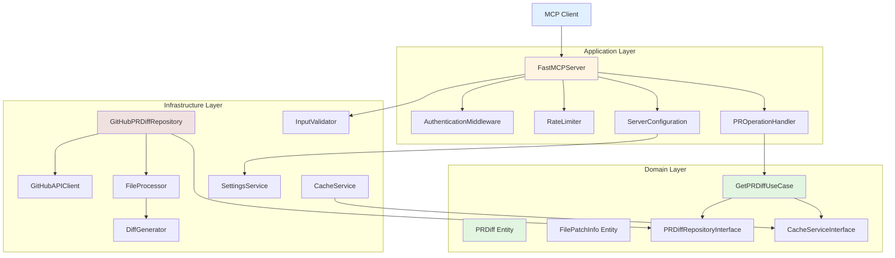
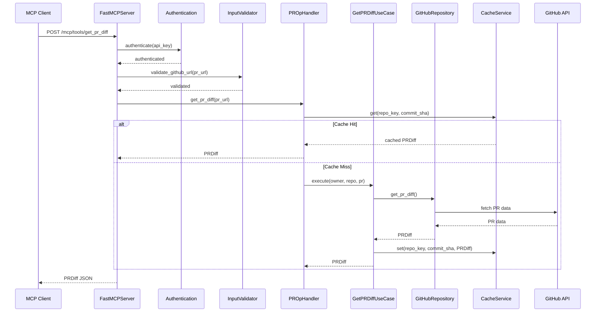
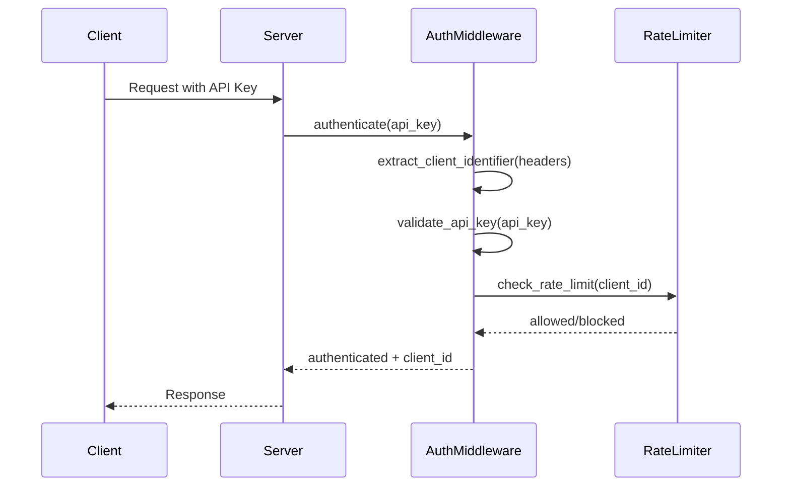
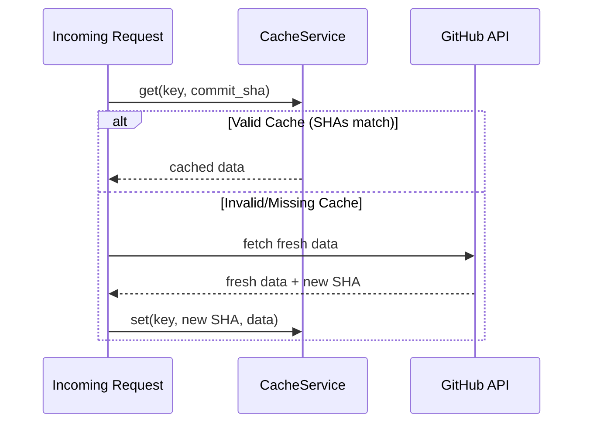
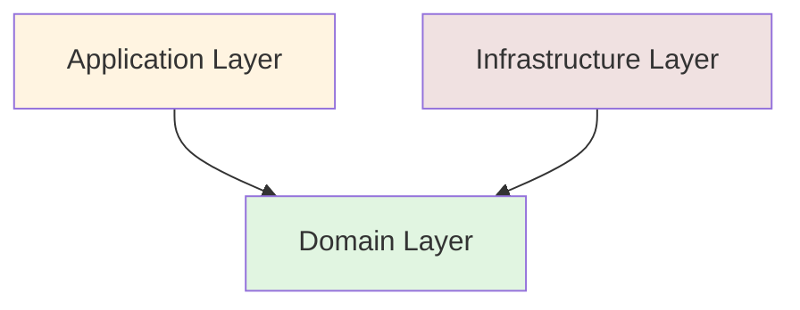
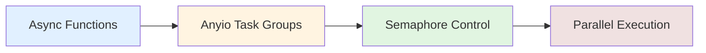
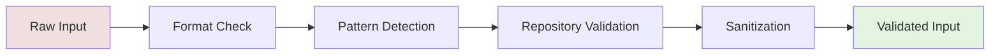

# Architecture Documentation

**Version:** 0.4.7
**Last Updated:** 2026-01-20

## Overview

PRDifferMCP follows **Clean Architecture** principles with clear separation of concerns. The system is divided into three distinct layers: Domain, Application, and Infrastructure. Each layer has specific responsibilities and well-defined boundaries.

---

## Table of Contents

1. [Architectural Principles](#architectural-principles)
2. [Layer Architecture](#layer-architecture)
3. [Component Diagram](#component-diagram)
4. [Data Flow](#data-flow)
5. [Design Patterns](#design-patterns)
6. [Key Components](#key-components)
7. [Dependency Flow](#dependency-flow)

---

## Architectural Principles

### Clean Architecture

The project follows Robert C. Martin's Clean Architecture principles:

1. **Independence of Frameworks**: Business logic doesn't depend on external frameworks
2. **Testability**: Business rules can be tested without UI, database, or web server
3. **Independence of UI**: The UI can change without changing the business rules
4. **Independence of Database**: Business rules are not bound to the database
5. **Independence of External Services**: Business rules don't know anything about the outside world

### Dependency Inversion

- **Dependencies point inward**: Infrastructure depends on Domain, Application depends on Domain
- **Domain is independent**: No dependencies on outer layers
- **Interfaces in Domain**: Abstractions defined in Domain layer

### Domain-Driven Design

- **Entities**: Core business objects with behavior
- **Value Objects**: Immutable values
- **Use Cases**: Application-specific business rules
- **Repositories**: Data access abstractions

---

## Layer Architecture



### Domain Layer (`prdiffer/domain/`)

**Purpose**: Contains business logic and enterprise rules.

**Components**:

```
domain/
├── entities/              # Core business objects
│   ├── file_patch.py      # FilePatchInfo - file change representation
│   └── pr_diff.py         # PRDiff - aggregate root for PR data
├── repositories/          # Repository interfaces
│   └── pr_diff_repository.py
├── services/              # Service interfaces
│   ├── cache_service_interface.py
│   ├── logger_service_interface.py
│   ├── settings_service_interface.py
│   └── ...
├── usecases/              # Business use cases
│   └── pr_diff_usecases.py
├── factories/             # Factory interfaces
│   └── infrastructure_factory.py
├── config/                # Configuration
│   └── github_config.py
└── errors.py              # Domain errors
```

**Key Characteristics**:
- No external dependencies
- Pure Python business logic
- Framework-agnostic
- Highly testable

### Application Layer (`prdiffer/application/`)

**Purpose**: Orchestrates domain objects and performs application-specific tasks.

**Components**:

```
application/
├── mcp_server.py          # FastMCP server implementation
├── components/            # Application components
│   ├── authentication.py  # Authentication middleware
│   ├── rate_limiter.py    # Rate limiting
│   ├── metrics_tracker.py # Metrics collection
│   ├── health_monitor.py  # Health monitoring
│   ├── pr_operation_handler.py  # PR operations
│   └── server_configuration.py   # Server config
├── interfaces/            # Protocol definitions
└── factory.py             # Component factory
```

**Key Characteristics**:
- Depends on Domain layer
- Manages application flow
- Handles external protocols (MCP)
- Thin - delegates to Domain

### Infrastructure Layer (`prdiffer/infrastructure/`)

**Purpose**: Provides external capabilities and technical details.

**Components**:

```
infrastructure/
├── github_repository.py   # GitHub API implementation
├── settings.py            # Configuration management
├── cache_service.py       # Caching implementation
├── request_coalescing.py  # Request deduplication
├── async_parallel_executor.py  # Parallel processing
├── github/                # GitHub-specific components
│   ├── api_client.py      # GitHub API client
│   ├── file_processor.py  # File processing
│   ├── diff_generator.py  # Diff generation
│   └── parallel_executor.py  # Parallel execution
├── utils/                 # Utility components
│   ├── retry_handler.py   # Retry logic
│   ├── pattern_matcher.py # Pattern matching
│   ├── diff_utils.py      # Diff operations
│   └── circuit_breaker.py # Circuit breaker
├── security/              # Security components
│   └── input_validator.py # Input validation
├── logging/               # Logging infrastructure
├── factories/             # Factory implementations
└── services/              # Service implementations
```

**Key Characteristics**:
- Implements Domain interfaces
- Contains framework dependencies
- Handles external integrations
- Provides technical implementations

---

## Component Diagram



---

## Data Flow

### PR Diff Request Flow



### Authentication Flow



### Caching Flow



---

## Design Patterns

### Repository Pattern

**Location**: `domain/repositories/`

**Purpose**: Abstract data access from business logic.

```python
# Interface in Domain
class PRDiffRepositoryInterface(ABC):
    @abstractmethod
    async def get_pr_diff(self) -> PRDiff: ...

# Implementation in Infrastructure
class GitHubPRDiffRepository(PRDiffRepositoryInterface):
    async def get_pr_diff(self) -> PRDiff:
        # GitHub API implementation
```

### Factory Pattern

**Location**: `domain/factories/`, `infrastructure/factories/`

**Purpose**: Create complex objects with dependency injection.

```python
# Interface
class InfrastructureFactoryInterface(ABC):
    @abstractmethod
    def create_cache_service(self) -> CacheServiceInterface: ...

# Implementation
class InfrastructureFactory(InfrastructureFactoryInterface):
    def create_cache_service(self) -> CacheServiceInterface:
        return CacheService(...)
```

### Strategy Pattern

**Location**: `infrastructure/utils/retry_handler.py`

**Purpose**: Encapsulate different retry strategies.

```python
# Context-aware retry strategies
RETRY_STRATEGIES = {
    "fetch_pr": RetryStrategy(aggressive=True),
    "get_file": RetryStrategy(aggressive=False),
    "create_status": RetryStrategy(allow_404=True),
}
```

### Circuit Breaker Pattern

**Location**: `infrastructure/utils/circuit_breaker.py`

**Purpose**: Prevent cascading failures.

```python
# States: CLOSED -> OPEN -> HALF_OPEN -> CLOSED
# Transitions based on failure threshold and timeout
```

### Dependency Injection

**Location**: Throughout the codebase

**Purpose**: Loose coupling and testability.

```python
# Constructor injection
class GetPRDiffUseCase:
    def __init__(
        self,
        repository: PRDiffRepositoryInterface,
        cache_service: CacheServiceInterface,
    ):
        self._repository = repository
        self._cache = cache_service
```

### Request Coalescing Pattern

**Location**: `infrastructure/request_coalescing.py`

**Purpose**: Deduplicate concurrent requests for same resource.

```python
# Multiple concurrent requests for same PR
# Only one GitHub API call is made
# All waiters receive the same result
```

---

## Key Components

### FastMCPServer

**File**: `application/mcp_server.py`

**Responsibilities**:
- MCP protocol handling
- Tool registration
- Request orchestration
- Security validation

**Key Methods**:
- `_register_tools()`: Register MCP tools
- `_authenticate_request()`: Validate API keys
- `_parse_pr_url()`: Extract PR components
- `get_pr_diff`: Main tool handler

### GitHubPRDiffRepository

**File**: `infrastructure/github_repository.py`

**Responsibilities**:
- GitHub API integration
- PR data fetching
- Diff generation
- Error handling

**Key Methods**:
- `get_pr_diff()`: Fetch complete PR diff
- `get_latest_commit_sha()`: Get current commit

### GetPRDiffUseCase

**File**: `domain/usecases/pr_diff_usecases.py`

**Responsibilities**:
- Business logic orchestration
- Cache coordination
- Data transformation

**Key Methods**:
- `execute()`: Main use case execution

### CacheService

**File**: `infrastructure/cache_service.py`

**Responsibilities**:
- In-memory caching
- Commit-based invalidation
- Cache statistics

**Key Methods**:
- `get()`: Retrieve cached value
- `set()`: Store value with commit SHA
- `invalidate()`: Invalidate cache entry

### AuthenticationMiddleware

**File**: `application/components/authentication.py`

**Responsibilities**:
- API key validation
- JWT token verification
- Brute-force protection
- Rate limiting integration

**Key Methods**:
- `authenticate()`: Validate API key
- `verify_jwt_token()`: Verify JWT signature
- `extract_client_identifier()`: Extract from headers

---

## Dependency Flow



### Dependency Rules

1. **Domain** → No dependencies
2. **Application** → Depends on Domain
3. **Infrastructure** → Depends on Domain (implements interfaces)
4. **External** → Dependencies flow inward only

### Import Rules

**✅ Allowed**:
```python
# Application importing Domain
from prdiffer.domain.usecases import GetPRDiffUseCase
from prdiffer.domain.repositories import PRDiffRepositoryInterface

# Infrastructure importing Domain
from prdiffer.domain.services import CacheServiceInterface
```

**❌ Not Allowed**:
```python
# Domain importing Application
from prdiffer.application import ...  # FORBIDDEN

# Domain importing Infrastructure
from prdiffer.infrastructure import ...  # FORBIDDEN
```

---

## Module Interactions

### Component Interaction Matrix

| Component | Domain | Application | Infrastructure |
|-----------|--------|-------------|----------------|
| Domain | ✓ | ✗ | ✗ |
| Application | ✓ | ✓ | ✗ |
| Infrastructure | ✓ | ✗ | ✓ |
| External | ✗ | ✗ | ✓ |

---

## Data Structures

### PRDiff Entity

```python
@dataclass
class PRDiff:
    """Aggregate root for PR diff data."""

    diff_content: str
    commit_messages: str
    files_changed: int
    total_additions: int
    total_deletions: int
    generation_metadata: GenerationMetadata
    file_summaries: List[FileSummary]
```

### FilePatchInfo Entity

```python
@dataclass
class FilePatchInfo:
    """Represents a single file's changes."""

    filename: str
    base_file: str
    head_file: str
    patch: str
    edit_type: EditType
    num_plus_lines: int
    num_minus_lines: int
    language: Optional[str]
```

---

## Concurrency Model

### Async Architecture



**Key Components**:
- **AsyncParallelExecutor**: Task group-based parallel processing
- **RequestCoalescingService**: Deduplicate concurrent requests
- **CircuitBreaker**: Async circuit breaker with anyio.Lock

### Thread Safety

- **CacheService**: RLock-protected operations
- **RequestCoalescing**: Anyio primitives for async safety
- **Authentication**: RLock for failure tracking

---

## Security Architecture

### Input Validation Chain



### Security Layers

1. **Authentication**: API key/JWT validation
2. **Rate Limiting**: Per-client throttling
3. **Input Validation**: Comprehensive sanitization
4. **Safe Logging**: Sensitive data redaction

---

## Extensibility

### Adding New Tools

1. Define tool in `FastMCPServer`
2. Create use case in Domain
3. Implement repository in Infrastructure
4. Add tests

### Adding New Integrations

1. Define interface in Domain
2. Implement in Infrastructure
3. Wire up in Factory
4. Add configuration

---

## Performance Considerations

### Caching Strategy

- **Commit-based**: Keys include commit SHA
- **Automatic invalidation**: New commits invalidate cache
- **Memory management**: LRU eviction with TTL

### Parallel Processing

- **File processing**: Parallel with semaphore control
- **Diff generation**: Configurable worker threads
- **Request coalescing**: Deduplicate concurrent calls

### Rate Limiting

- **Per-client**: Independent limits per authenticated client
- **Token bucket**: Burst protection
- **Configurable**: Adjust per environment

---

*Last Updated: 2026-01-20*
